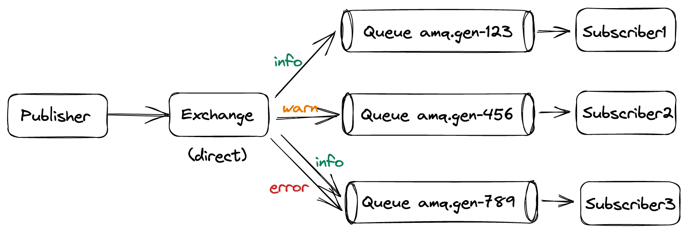

# Routing to multiple subscribers

## Concept



## How to Use

### Start the producer
```
go run main.go
>> info Hey there
>> info Some info message
>> warn Uh oh, low on battery
>> error Run! Get to the choppa!
```

### Start consumer 1 (info logger)
```
go run main.go info
2023/04/30 14:33:40 Received: Hey there
2023/04/30 14:33:42 Received: Some info message
```

### Start consumer 2 (warn logger)
```
go run main.go warn
2023/04/30 14:33:50 Received: Uh oh, low on battery
```

### Start consumer 3 (error logger)
```
go run main.go error
2023/04/30 14:33:58 Received: Run! Get to the choppa!
```

### Start consumer 4 (everything logger)
```
go run main.go info warn error
2023/04/30 14:33:40 Received: Hey there
2023/04/30 14:33:42 Received: Some info message
2023/04/30 14:33:50 Received: Uh oh, low on battery
2023/04/30 14:33:58 Received: Run! Get to the choppa!
```
